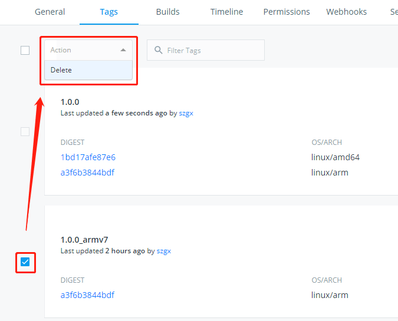

# 镜像构建说明

## 如何构建、发布跨平台 Docker 镜像

为了保持用户在不同平台使用 Passets 的操纵一致性，需要将不同平台的容器镜像获取方式统一，减少使用者由于选择平台不当导致的容器启动错误问题。

操作步骤：

**第一步**

从 GitHUB 上为各个模块添加一个Release版本，版本号和tag均采用 “`数字.数字.数字`” 格式，添加完成后，DockerHUB 会自动开始构建对应版本的镜像。

**第二步**

等待第一步各模块的镜像构建完成后，在其它平台下构建对应的镜像文件，镜像的tag统一在对应版本号后面加上后缀 “`_<架构名>`”，然后提交到 DockerHUB 。例如：`dsolab/passets-api:1.0.1_armv7`。
```
# 构建
docker build -t dsolab/passets-<module>:<version>_<arch> .
# 提交到 Docker HUB （很重要）
docker push dsolab/passets-<module>:<version>_<arch>
```

**第三步**

借助 Docker 的 manifest 列表功能来实现多平台镜像融合机制。

在操作合并镜像的主机上启用 Docker 的 manifest 功能（实验性功能）：
```
vi ~/.docker/config.json
{
    ... ...
    "experimental": "enabled"
}
```

删除缓存的 manifest 文件：
```
rm -rf ~/.docker/manifests/*
# 如果本地镜像列表中包含要融合的镜像，可能还需要执行下面的操作
docker manifest inspect dsolab/passets-<module>:<version>_<arch>
```

创建多版本融合 manifests：
```
docker manifest create dsolab/passets-<module>:<version> dsolab/passets-<module>:<version> dsolab/passets-<module>:<version>_<arch> -a
```

创建成功后核对 manifest 中对应平台镜像的 SHA256 值与Dockerhub上是否正确：
```
docker manifest inspect dsolab/passets-<module>:<version>
```

确认无误后，提交 manifests:
```
docker manifest push dsolab/passets-<module>:<version> -p
```

**第四步**

从 DockerHUB 上删除孤立的镜像，仅保留融合后的镜像。
