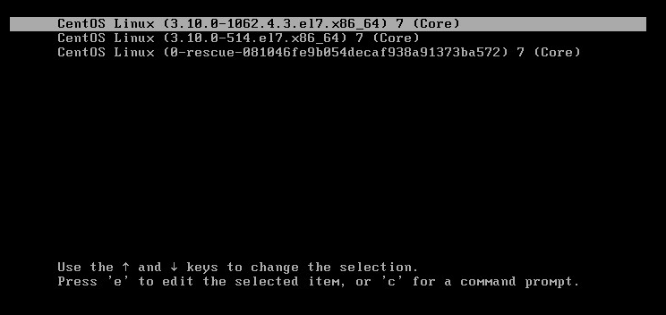

### PF_RING安装

pf_ring需要在docker所在的宿主机上安装，详细说明，可以参见官方支持文档。

```
http://packages.ntop.org/
```

### 安装参考 - CentOS 7.3

**第一步**：安装pf_ring

**在线环境安装pf_ring**

```
yum -y install wget net-tools
cd /etc/yum.repos.d/
wget http://packages.ntop.org/centos/ntop.repo -O ntop.repo
rpm -ivh https://dl.fedoraproject.org/pub/epel/epel-release-latest-7.noarch.rpm
yum clean all
yum update
yum -y install pfring-dkms
```

**离线环境安装pf_ring**

pf_ring离线yum源制作：

```
mkdir -p /opt/yum-repo

yum install --downloadonly --downloaddir=/opt/yum-repo net-tools wget createrepo 
yum -y install wget net-tools createrepo
cd /etc/yum.repos.d/
wget http://packages.ntop.org/centos/ntop.repo -O ntop.repo
rpm -ivh https://dl.fedoraproject.org/pub/epel/epel-release-latest-7.noarch.rpm
yum clean all

yum update --downloadonly --downloaddir=/opt/yum-repo
yum install --downloadonly --downloaddir=/opt/yum-repo pfring-dkms

createrepo -pdo /opt/yum-repo /opt/yum-repo 
createrepo --update /opt/yum-repo

tar zcvf /opt/yum-repo.tar.gz /opt/yum-repo/
```

pf_ring离线yum源安装：

```
vi /etc/yum.repos.d/localyum.repo

[localyum]
name=localyum
baseurl=file:///opt/yum-repo
enable=1
gpgcheck=0
```

```
tar zxvf yum-repo.tar.gz -C /opt/

mkdir /etc/yum.repos.d/bak
mv /etc/yum.repos.d/CentOS-* /etc/yum.repos.d/bak/
yum clean all
yum makecache
yum update
rm -rf /etc/yum.repos.d/CentOS-*
```

```
yum install net-tools wget createrepo pfring-dkms
```

**第二步**：内核升级后重启使配置生效（不同版本系统升级后的内核版本不一样，根据实际情况选择）

方法一：重启，手工选择。

宿主机重启，grub引导时选择升级后的内核启动：



方法二：修改默认grub配置，重启。

```bash
# 查看所有的内核版本
cat /boot/grub2/grub.cfg | grep "menuentry"

# 修改默认启动内核
grub2-set-default 'CentOS Linux (3.10.0-1127.18.2.el7.x86_64) 7 (Core)'

# 检查配置是否生效
grub2-editenv list
```

**第三步**：pf_ring启动、功能测试:

```
systemctl start pf_ring
systemctl enable pf_ring

pfcount -i <流量镜像网卡>
```

#### 网卡驱动兼容

pf_ring网卡兼容性官方介绍：

```
https://www.ntop.org/products/packet-capture/pf_ring/
```

intel千兆网卡支持清单：

```
https://www.intel.com/content/www/us/en/support/articles/000005480/network-and-i-o/ethernet-products.html
```

intel万兆网卡支持清单：

```
https://downloadcenter.intel.com/download/14687/Intel-Network-Adapter-Driver-for-PCIe-Intel-10-Gigabit-Ethernet-Network-Connections-Under-Linux-?wapkw=ixgbe
```


