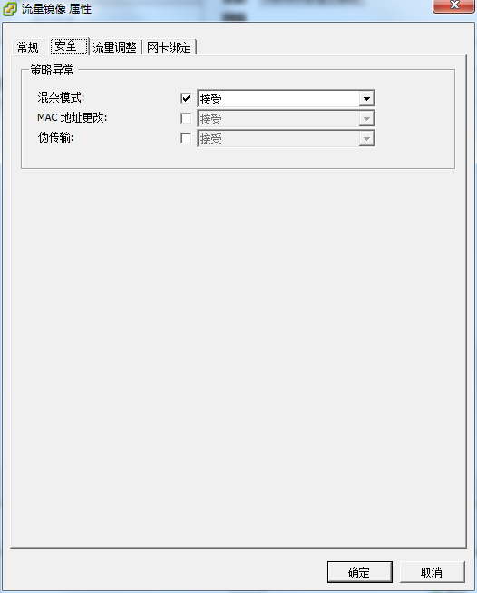

### PF_RING安装

pf_ring需要在docker所在的宿主机上安装，详细说明，可以参见官方支持文档。

```
http://packages.ntop.org/
```

### 安装参考 - CentOS 7.3

**第一步：**pf_ring安装、内核升级:

```
yum -y install wget net-tools
cd /etc/yum.repos.d/
wget http://packages.ntop.org/centos/ntop.repo -O ntop.repo
rpm -ivh https://dl.fedoraproject.org/pub/epel/epel-release-latest-7.noarch.rpm
yum clean all
yum update
yum install pfring-dkms
```

**第二步：**宿主机重启，选择升级后的内核启动：


**第三步：**pf_ring启动、功能测试:

```
systemctl start pf_ring
systemctl enable pf_ring

pfcount -i ens192
```

### 虚拟化场景网络配置

**第一步：**创建虚拟交换机网络，并分配独立物理网口，该网口用于接收流量镜像数据使用。


**第二步：**虚拟交换机属性配置，开启”混杂模式“。




